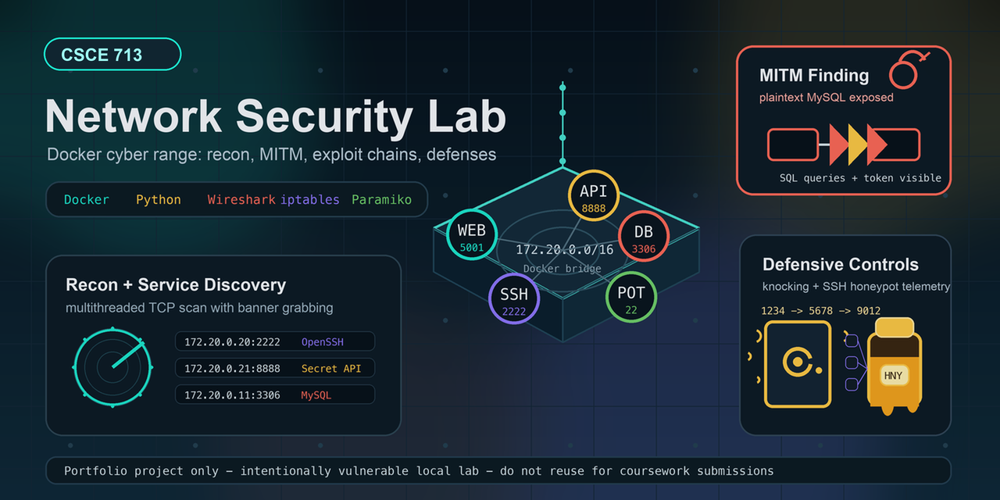

# Network Security Lab



A Docker-based network security lab for practicing service discovery, traffic analysis, exploitation chaining, and defensive controls. This repository contains my implementation for CSCE 713 Assignment 2, reshaped here as a portfolio project to show practical security engineering work across Python tooling, Docker networking, packet analysis, firewall rules, and honeypot logging.

The original course prompt has been preserved in [ASSIGNMENT_INSTRUCTIONS.md](ASSIGNMENT_INSTRUCTIONS.md).

## Demo

Watch the walkthrough video here: [Google Drive demo](https://drive.google.com/file/d/1DmXUXajfRqO0daoT1ZMrLp1voedzim6Q/view?usp=sharing)

## What This Project Demonstrates

- Custom TCP port scanning with threading, banner grabbing, CIDR target support, timing data, and JSON output.
- Docker network reconnaissance across intentionally hidden services.
- Man-in-the-middle traffic inspection of plaintext MySQL communication using Wireshark packet captures.
- Exploit chaining from network discovery to API authentication.
- Port knocking with Linux `iptables` and the `recent` module to protect a hidden service.
- SSH honeypot behavior using Paramiko, realistic shell responses, structured logging, and attack analysis.
- Clear security reporting with evidence, findings, and remediation recommendations.

## Assessment Highlights

- Scanned Docker hosts across the full TCP port range and identified hidden services including SSH on `2222`, a secret API on `8888`, and MySQL-related exposure.
- Confirmed that MySQL traffic between the Flask application and database was sent without TLS, exposing SQL queries, user records, schema details, and sensitive token data to packet capture.
- Chained the exposed token into authenticated access against the hidden API, demonstrating how one plaintext internal service can compromise another service.
- Implemented firewall-level port knocking with `iptables` and the Linux `recent` module, using a time-bound knock sequence before allowing access to the protected port.
- Built a Paramiko-based SSH honeypot that logs connection metadata, username/password attempts, executed commands, session duration, and repeated failed login alerts.

## Remediation Themes

The report recommends enforcing TLS for database communication, segmenting Docker networks by service role, removing weak/default credentials, restricting internal service exposure, and centralizing detection through logs, IDS tooling, and alerting. Future improvements include encrypted knock payloads, deeper honeypot filesystem simulation, multi-service protection, and SIEM integration.

## Architecture

The lab runs as a multi-container Docker environment on the `172.20.0.0/16` bridge network.

| Component | Path | Purpose |
| --- | --- | --- |
| Web application | [web_app/](web_app/) | Flask app exposed on `localhost:5001`; intentionally communicates with MySQL without TLS. |
| Database | [database/](database/) | MySQL service seeded with users and secret data for traffic-analysis exercises. |
| Secret SSH service | [secret_ssh/](secret_ssh/) | Hidden SSH target on a non-standard port. |
| Secret API | [secret_api/](secret_api/) | Hidden Flask API that requires a token obtained through traffic analysis. |
| Redis service | [redis_service/](redis_service/) | Internal service included in the reconnaissance surface. |
| Port scanner | [port_scanner/](port_scanner/) | Python scanner implementation and scan artifacts. |
| MITM evidence | [mitm/](mitm/) | Wireshark screenshots, packet capture, and vulnerability write-up. |
| Port knocking | [port_knocking/](port_knocking/) | Defensive control using knock sequences and firewall rules. |
| Honeypot | [honeypot/](honeypot/) | SSH honeypot implementation, logs, and attack analysis. |

## Detailed Write-ups

The repository has focused sub-READMEs for each major part of the work:

- [Port scanner and service exploitation](port_scanner/README.md)
- [MITM attack documentation](mitm/README.md)
- [Port knocking implementation](port_knocking/README.md)
- [Honeypot implementation notes](honeypot/README.md)
- [Honeypot attack analysis](honeypot/analysis.md)

## Running Locally

This project is intentionally vulnerable. Run it only in an isolated local Docker environment.

```bash
git clone https://github.com/lazymaster101/csce413_assignment2.git
cd csce413_assignment2
docker compose up --build
```

After the containers start, open the web app at:

```text
http://localhost:5001
```

To stop the environment:

```bash
docker compose down
```

To stop the environment and remove persistent database data:

```bash
docker compose down -v
```

## Repository Preview Image

The GitHub preview asset is stored at [assets/github-preview.png](assets/github-preview.png). It can be used in the README or uploaded as the repository social preview image in GitHub settings.

## Security Notice

This repository contains intentionally vulnerable services, lab flags, packet captures, and defensive proof-of-concept code. It is for local education, portfolio review, and controlled demonstration only. Do not deploy these services to a public network.

## Academic Integrity Notice

This repository is published only to demonstrate my technical skills to employers and reviewers. Current or future students should not copy, reuse, submit, or adapt this code for coursework. Using this repository for an academic submission will cause a violation of the Texas A&M Aggie Honor Code and course academic integrity policies.
