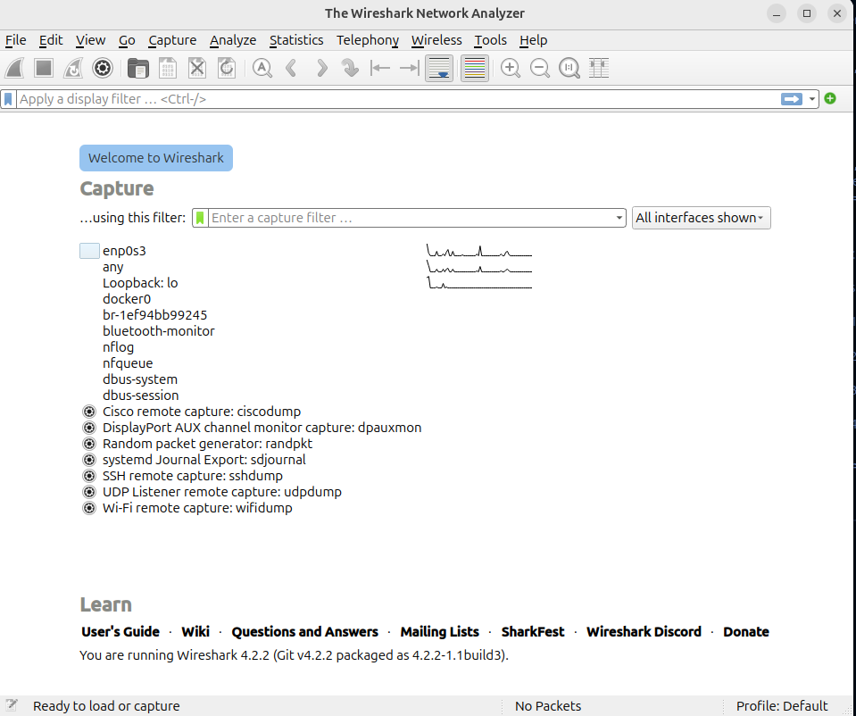
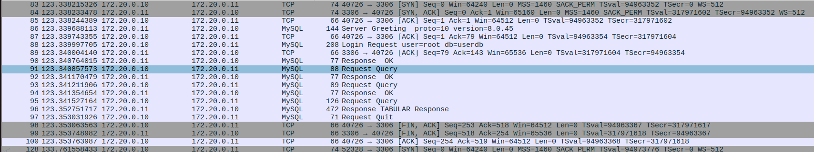
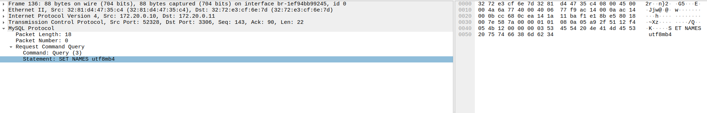
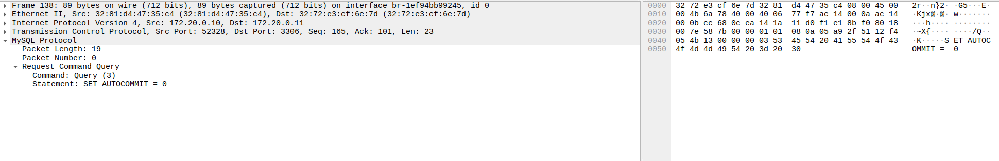
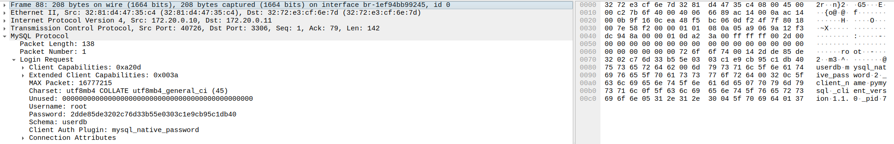
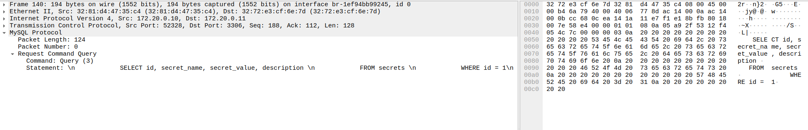
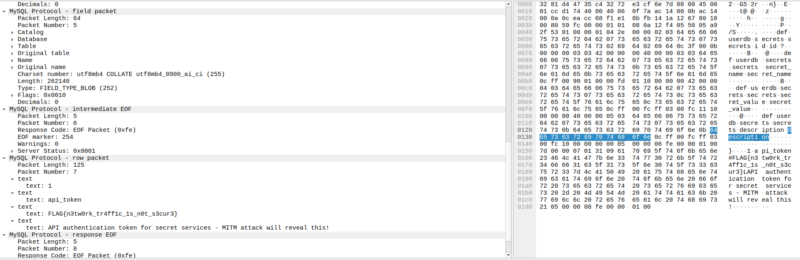
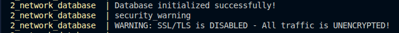

# MITM Attack Documentation

## Overview

This document details the Man-in-the-Middle (MITM) attack performed on the web application running on IP address `172.20.0.10:5000` to capture and analyze unencrypted network traffic between the application and the MySQL database running on IP address `172.20.0.11:3306`. The attack successfully revealed sensitive data transmitted in plaintext over the network.

## Setup and Environment

### Initial Environment
- **Target**: Web application with MySQL database backend
- **Database**: MySQL 8.0.45
- **Port**: 3306 (MySQL default)
- **Sniffing Network**: Docker bridge network

### Prerequisites
- Docker and Docker Compose
- Wireshark
- Ubuntu VM
- Network packet capture tools (tcpdump/Wireshark)

## Ubuntu VM Initial Setup

### System Updates and Basic Tools

```bash
# Update package lists
sudo apt update

# Install Linux headers (required for various kernel modules)
sudo apt install linux-headers-$(uname -r)

# Install tcpdump for packet capture
sudo apt install tcpdump

# Install git for version control
sudo apt install git
```

### Docker Installation (Using Docker's APT Repository)

```bash
# Add Docker's official GPG key:
sudo apt-get update
sudo apt-get install ca-certificates curl
sudo install -m 0755 -d /etc/apt/keyrings
sudo curl -fsSL https://download.docker.com/linux/ubuntu/gpg -o /etc/apt/keyrings/docker.asc
sudo chmod a+r /etc/apt/keyrings/docker.asc

# Add the repository to Apt sources:
echo \
  "deb [arch=$(dpkg --print-architecture) signed-by=/etc/apt/keyrings/docker.asc] https://download.docker.com/linux/ubuntu \
  $(. /etc/os-release && echo "$VERSION_CODENAME") stable" | \
  sudo tee /etc/apt/sources.list.d/docker.list > /dev/null
sudo apt-get update

# Install Docker packages
sudo apt-get install docker-ce docker-ce-cli containerd.io docker-buildx-plugin docker-compose-plugin

# Verify Docker installation
sudo docker run hello-world
```

### Wireshark Installation

```bash
# Install Wireshark
sudo apt install wireshark

# Add current user to wireshark group to capture packets without sudo
sudo usermod -aG wireshark $USER

# Reboot or log out and log back in for group changes to take effect

# To run wireshark
sudo wireshark
```

### VS Code Installation

```bash
# Download VS Code .deb package (replace with current version)
https://go.microsoft.com/fwlink/?LinkID=760868

# Install VS Code

sudo dpkg -i <file>.deb
sudo apt-get install -f # Install dependencies
```

## Steps Performed

### 1. Starting the Application

First, the Docker containers were started using Docker Compose:

```bash
sudo docker compose up --build
sudo docker compose up -d
```

This command builds and launches both the web application and database containers on a shared Docker bridge network.

### 2. Initial Attempt on macOS

An initial attempt was made to capture traffic directly on macOS:

```bash
# Listed Docker networks to find the bridge network ID
docker network ls

# Attempted to capture traffic on the bridge interface
sudo tcpdump -i br-<network_id> -A -s 0 'port 3306'
```

**Issue Encountered**: macOS terminal reported "no interface called br-<network_id>". This is because Docker on macOS runs in a VM, and the bridge interfaces are not directly accessible from the host system.

### 3. Solution: Ubuntu VM Setup

Following a suggestion from Ali to run the containers inside Ubuntu, the following steps were taken:

1. Installed Ubuntu VM on Windows host machine
2. Installed Docker on the Ubuntu VM
3. Ran the Docker containers within the Ubuntu environment
4. Installed Wireshark on Ubuntu for packet analysis

### 4. Packet Capture with Wireshark

#### Wireshark Configuration

1. Launched Wireshark application on Ubuntu
2. Located the Docker bridge interface (`br-<network_id>`) in the interface list
3. Double-clicked the bridge interface to start capturing
4. Applied display filter: `tcp.port == 3306`

#### Traffic Generation

To trigger database queries and generate network traffic:

1. Opened the web application in Firefox browser
2. Navigated through different pages of the application
3. Accessed various endpoints to trigger SQL queries
4. Specifically accessed `/api/secrets` endpoint

## Findings

### Captured SQL Queries

The packet capture revealed multiple unencrypted SQL queries being transmitted over the network:

#### Connection Setup
```sql
SET NAMES utf8mb4
SET AUTOCOMMIT = 0
```

#### User Data Query
```sql
SELECT id, username, email, role FROM users ORDER BY id
```

#### Secrets Query
```sql
SELECT id, secret_name, secret_value, description 
FROM secrets 
WHERE id = 1
```

### Evidence Screenshots

The following screenshots document the captured traffic:


*Caption: Wireshark showing the Docker bridge interface br-1ef94bb99245*


## Wireshark Packet Capture Analysis


*Caption: Unencrypted SQL queries visible in packet capture*

### Key Observations:

**TCP Connection Establishment (Packets 83-85)**
- Three-way handshake between application and database
- Packet 83: [SYN] - Connection initiation from 172.20.0.10 to 172.20.0.11:3306
- Packet 84: [SYN, ACK] - Database acknowledges connection request
- Packet 85: [ACK] - Application confirms connection established

**MySQL Protocol Traffic (Packets 86-96)**
- Packet 86: MySQL Server Greeting (protocol version 10, MySQL 8.0.45)
- Packet 88: MySQL Login Request (user=root, db=userdb)
- Packet 90: MySQL Response OK - Authentication successful
- Packets 91-97: Series of MySQL Request Query and Response OK packets

*Caption: *

*Caption: *

**Packets 97-100: TCP Connection Termination**
- Packet 97: Request QUIT: The website sends a disconnection request to the database.
- Packet 98: [FIN, ACK]: Database initiates connection closure after receiving QUIT command
- Packet 99: [FIN, ACK]: Additional FIN packet (possible retransmission or acknowledgment)
- Packet 100: [ACK]: Application acknowledges and completes the four-way TCP handshake termination


**Unencrypted Communication**
All MySQL traffic is transmitted in plaintext, as evidenced by the readable protocol information. The packet capture clearly shows:
- Database authentication details (username: root, database: userdb). However, it does seem like for every authentication attempt, the password is hashed with a salt.

*Caption: Unencrypted SQL queries visible in packet capture*


This capture demonstrates the critical vulnerability: anyone with network access can intercept and read all database communications, including queries, responses, and authentication attempts.

**Flag Retrieval**


*Caption: Traffic from /api/secrets endpoint*


*Caption: Traffic from /api/secrets endpoint*

### Sensitive Data Discovered

#### Flag Captured
When accessing `/api/secrets` from the website, the following flag was visible in plaintext:

```
FLAG{n3tw0rk_tr4ff1c_1s_n0t_s3cur3}
```

#### Password Handling Observation

While examining the captured packets, it was observed that database authentication passwords appear to be hashed with salting. Each new connection to the database shows a different password value, indicating the use of MySQL's `mysql_native_password`. This can also be confirmed from the docker compose logs


However, this does not protect the actual data being transmitted after authentication.

## Vulnerability Analysis

### Security Issues Identified

#### 1. Unencrypted Database Traffic

**Severity**: Critical

**Description**: All communication between the web application and MySQL database occurs over an unencrypted connection. This is explicitly confirmed in the Docker logs:




**Impact**:
- SQL queries are visible in plaintext
- Query results containing sensitive data are transmitted unencrypted
- User information (usernames, emails, roles) can be intercepted
- Secret data including flags and sensitive values are exposed
- Database schema and table structure can be reverse-engineered

#### 2. Deprecated Authentication Plugin

**Severity**: Medium

**Description**: The MySQL server is configured to use the deprecated `mysql_native_password` authentication plugin:


**Impact**:
- Using outdated authentication mechanisms
- Less secure than modern alternatives
- May be vulnerable to known attacks against older authentication schemes

#### 3. Network Exposure

**Severity**: High

**Description**: Database traffic on port 3306 is accessible from any container on the Docker bridge network.

**Impact**:
- Any compromised container on the same network can capture database traffic
- Lateral movement attacks become easier
- No network segmentation between application and database layers

### Attack Scenario

An attacker with access to the Docker bridge network (or any network path between the application and database) can:

1. Capture all database queries and responses using packet sniffing tools
2. Extract sensitive information including:
   - User credentials and personal information
   - Application secrets and configuration data
   - Business logic through SQL query analysis
   - Database schema and structure
3. Potentially modify traffic (in a more advanced MITM attack)
4. Replay captured queries
5. Use gathered information for further attacks

## Recommendations


1. **Enable SSL/TLS for MySQL Connections**
   - Generate SSL certificates for MySQL server
   - Configure MySQL to require SSL/TLS connections
   - Update application connection strings to use SSL

2. **Update Authentication Plugin**
   - Migrate from `mysql_native_password` to `caching_sha2_password`

3. **Network Segmentation**
   - Implement network policies to restrict database access
   - Use Docker network isolation features

4. **Implement End-to-End Encryption**
   - Encrypt sensitive data at the application layer
   - Use encryption at rest for database storage

5. **Network Monitoring and Intrusion Detection**
   - Deploy network monitoring tools
   - Set up alerts for unusual database traffic patterns
   - Implement intrusion detection systems (IDS)

6. **Principle of Least Privilege**
   - Limit database user permissions
   - Use separate credentials for different application components
   - Implement role-based access control

## Conclusion

This MITM attack successfully demonstrated that the application transmits sensitive data over unencrypted network connections. The lack of SSL/TLS encryption for database traffic represents a critical security vulnerability that could lead to:

- Data breaches
- Unauthorized access to sensitive information


The captured flag `FLAG{n3tw0rk_tr4ff1c_1s_n0t_s3cur3}` serves as proof of concept that network traffic can be intercepted and read by anyone with access to the network path between the application and database.


## Resources

- [Docker Documentation - Install Docker Engine on Ubuntu](https://docs.docker.com/engine/install/ubuntu/)

## Artifacts

All packet captures and screenshots are stored in this directory:

- `capture.pcap` - Full packet capture file

---