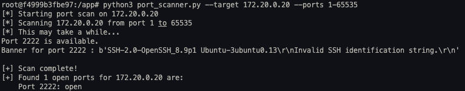

# Network Security Lab - Port Scanning and Service Exploitation

## Overview

This document describes the process of discovering and exploiting hidden services in a Docker network environment using port scanning and network analysis techniques.

## Lab Environment Setup

### Docker Network Architecture

The lab consists of multiple Docker containers running on the `2_network` network:

| Container Name | IP Address | Purpose |
|---------------|------------|---------|
| 2_network_webapp | 172.20.0.10 | Web application (scanning platform) |
| 2_network_database | 172.20.0.11 | Database service |
| 2_network_redis | 172.20.0.22 | Redis cache |
| 2_network_secret_ssh | 172.20.0.20 | Hidden SSH service |
| 2_network_port_knocking | 172.20.0.30 | Port knocking server |
| 2_network_secret_api | 172.20.0.21 | Hidden API service |

### Verifying Container IPs

List all running containers:
```bash
docker ps
```

Check IP addresses of specific containers:
```bash
docker inspect 2_network_<name> | grep "IP"
```

## Port Scanning Process

### Setting Up the Scanner

Access the webapp container shell (assuming all containers are running):
```bash
docker exec -it 2_network_webapp /bin/bash
```

Copy the port scanner script into the container while inside the port_scanner directory on the local machine:
```bash
docker cp port_scanner.py 2_network_webapp:/app
```

### Running the Scan

Inside the webapp container, scan all ports on target containers:
```bash
python3 port_scanner.py --target <IP address> --ports 1-65535
```

Default parameters:
- **Threads**: 100
- **Timeout**: 3 seconds

The scan results are displayed in the terminal with a summary, while full details are saved to a JSON file.




### Retrieving Scan Results

Copy the JSON results back to the local machine:
```bash
docker cp 2_network_webapp:/app/scan_results_<IP>.json ./
```

## Flag 1: Port Knocking Service Discovery
### Discovery
I opened up the web app that was running on **172.20.0.10:5000** and opened the /api/secrets page to reveal this flag. This flag is supposed to be revealed through the MITM attack which I later talk about in the google document. Furthermore, when the website was not opening, I used the curl command to get the contents of the webpage.

### Exploitation Steps

Install curl inside the webapp container:
```bash
apt update
apt install curl -y
```
Use curl to access the secrets page:
```bash
curl 172.20.0.10:5000/api/secrets
``` 

This returned the flag:
```FLAG{n3tw0rk_tr4ff1c_1s_n0t_s3cur3}```   

## Flag 2: Hidden SSH Service Exploitation

### Discovery

Port scanning revealed port **2222** open on IP address **172.20.0.20** with banner grabbing identifying it as an SSH service.

### Exploitation Steps

Install SSH client inside the webapp container:
```bash
apt update
apt install openssh-client openssh-server
```

Initial connection attempt:
```bash
ssh -p 2222 user@172.20.0.20
```

The service responded with a banner indicating the correct username is `sshuser`.

Successful authentication:
```bash
ssh -p 2222 sshuser@172.20.0.20
```

After entering the password, access was granted. The flag was retrieved using:
```bash
cat <flag_file>
```

This returned the flag:
```FLAG{h1dd3n_s3rv1c3s_n33d_pr0t3ct10n}```   

## Flag 3: Hidden API Service Exploitation

### Tool Installation

Install required tools inside the web application container:
```bash
apt update
apt install curl -y
apt install telnet -y
```

### Service Discovery

Port scanning identified a hidden service on port **8888** at IP **172.20.0.21**.

Initial reconnaissance:
```bash
curl 172.20.0.21:8888
```

### API Response Analysis

The service returned the following information:

```json
{
  "authentication": {
    "alternative": "?token=<token> query parameter",
    "header": "Authorization: Bearer <token>",
    "hint": "The token can be found by intercepting network traffic...",
    "type": "Bearer token"
  },
  "endpoints": [
    {"description": "API information", "method": "GET", "path": "/"},
    {"description": "Health check", "method": "GET", "path": "/health"},
    {"description": "Get flag (requires authentication)", "method": "GET", "path": "/flag"},
    {"description": "Get secret data (requires authentication)", "method": "GET", "path": "/data"}
  ],
  "message": "This is a hidden API service. Authentication required.",
  "port": 8888,
  "service": "Secret API Server",
  "status": "running",
  "version": "1.0"
}
```

### Token Extraction

The API requires a Bearer token for authentication. The token was discovered by querying the `/api/secrets` endpoint on the web application:

```bash
curl 172.20.0.10:5000/api/secrets
```

This returned the token:
```
FLAG{n3tw0rk_tr4ff1c_1s_n0t_s3cur3}
```

### Authenticated API Access

Using the discovered token, the hidden API `/flag` endpoint was accessed via telnet:

```bash
telnet 172.20.0.21 8888
GET /flag HTTP/1.1
Authorization: Bearer FLAG{n3tw0rk_tr4ff1c_1s_n0t_s3cur3}
```

```json
HTTP/1.1 200 OK
Server: Werkzeug/3.1.5 Python/3.11.14
Date: Mon, 09 Feb 2026 15:53:27 GMT
Content-Type: application/json
Content-Length: 540
Connection: close

{"flag":"FLAG{p0rt_kn0ck1ng_4nd_h0n3yp0ts_s4v3_th3_d4y}","message":"Congratulations! You successfully chained your exploits!","next_steps":["Now implement port knocking to protect the SSH service","Deploy a honeypot using the starter template"],"steps_completed":["1. Developed a port scanner","2. Discovered this hidden API service on port 8888","3. Performed MITM attack on database traffic","4. Extracted FLAG{1} (the API token) from network packets","5. Used FLAG{1} to authenticate to this API","6. Retrieved FLAG{3}"],"success":true}
Connection closed by foreign host.

```


The server responded with the flag, successfully completing Flag 3.

## Tools Used

- **Docker Desktop**: Container management and networking
- **VS Code**: Development environment
- **Python**: Port scanner implementation
- **curl**: HTTP API interaction
- **telnet**: Raw TCP connections
- **SSH client**: Secure shell access